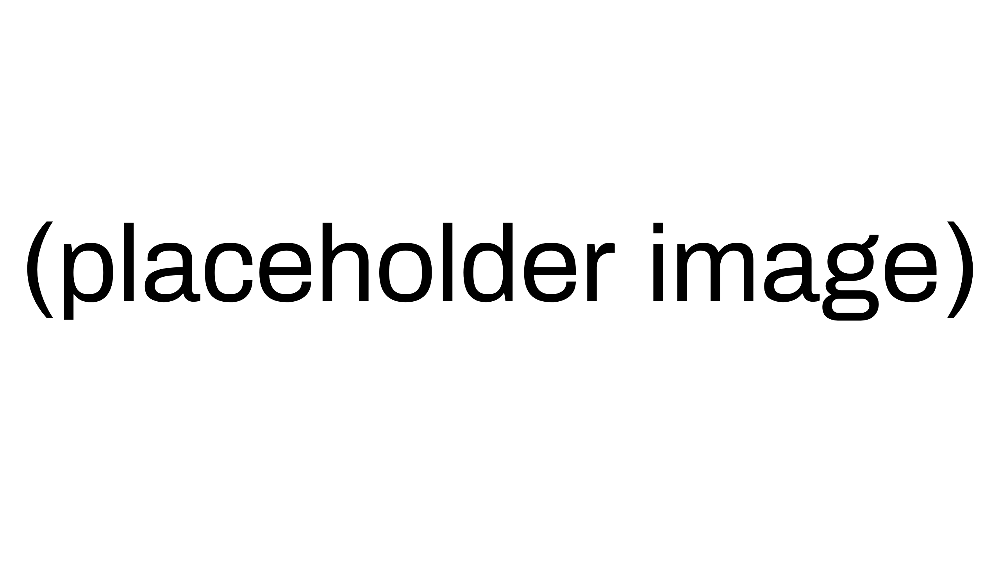

# Guía de Configuración del Entornos de Desarrollo

## 📖 Descripción

Crea una guía técnica sobre la instalación y configuración del entorno de desarrollo. Esta documentación debe servir como manual de configuración que permita a cualquier desarrollador configurar su entorno de desarrollo de manera consistente.

## 🎯 Qué Harás

- Crear una guía para instalar y configurar **VS Code** para desarrollo en C#
- Establecer configuraciones y extensiones recomendadas
- Crear y documentar un proyecto C# de ejemplo que sirva como verificación
- Documentar la configuración de **Visual Studio** como IDE alternativo
- Configurar y documentar el desarrollo con un **lenguaje adicional** (Java, Python, u otro)

Nota: Documentar el proceso con capturas de pantalla

## 📋 Estructura de Entrega

La documentación debe incluir estos archivos:

- `IDE_ONBOARDING_GUIDE.md` - Guía técnica de instalación y configuración
- `CONCLUSIONES_EVALUACION.md` - Evaluación y conclusiones sobre los entornos de desarrollo
- `screenshots/` - Capturas de pantalla y otros recursos visuales

## 🔧 Contenido Técnico

### 1. Visual Studio Code para C# (Entorno Principal)

**Instalación y Verificación:**
- Documentar el método de instalación recomendado
- Verificar la instalación correcta
- Documentar algún otro método alternativo si es relevante

**Uso Básico de VS Code:**
- Navegación por la interfaz
- Edición de código
- Uso de la paleta de comandos
- Gestión de archivos y carpetas

**Personalización del Entorno:**
- Temas e iconos
- Configuración de fuentes
- Idioma de interfaz
- Layout de paneles
- Atajos de teclado
- Configuración del editor
- Terminal integrada
- ...

**Configuración para C#:**
- Instala .NET SDK
- Verifica la instalación correcta
- Configura extensiones de C#

**Proyecto de Ejemplo:**
- Crea y ejecuta un proyecto "Hola Mundo"
- Documenta el proceso de debugging básico

### 2. Visual Studio (IDE Alternativo)

**Instalación:**
- Documentar la instalación de Visual Studio
- Componentes necesarios para desarrollo en C#
- Verificación de la instalación

**Desarrollo con C#:**
- Creación de un proyecto C# en Visual Studio
- Compilación y ejecución
- Herramientas de debugging básicas

### 3. Lenguaje Adicional (Java, Python u otro)

**Configuración del entorno:**
- Instalar el runtime/SDK necesario
- Configurar VS Code para el lenguaje elegido
- Extensiones recomendadas

**Proyecto de ejemplo:**
- Crea un proyecto simple en el lenguaje elegido
- Documenta el proceso de ejecución

## 💡 Calidad de la Documentación

Tu documentación técnica debe:

**✅ Ser clara y reproducible**
- Instrucciones paso a paso fáciles de seguir
- Configuraciones bien documentadas
- Soluciones a problemas comunes

**✅ Ser completa y técnicamente precisa**
- Información técnica actualizada
- Formato consistente y limpio
- Enlaces y recursos adicionales

## 📝 Instrucciones de Entrega

**Estructura del proyecto:**
- **Trabajo en parejas**
- **Usar la plantilla** `IDE_ONBOARDING_GUIDE.md` para crear la documentación técnica
- **Usar la plantilla** `CONCLUSIONES_EVALUACION.md` para evaluación y conclusiones
- **Organizar las capturas** en la carpeta `screenshots/`

**Metodología de dos fases:**
1. **Entrega inicial**: Configuración básica y primeras impresiones
2. **Entrega final**: Análisis maduro basado en experiencia de uso real

> **Ventaja del enfoque**: Es posible contrastar las primeras impresiones con la experiencia real tras semanas de uso, enriqueciendo significativamente el análisis final.

## 📚 Recursos de Ayuda

- [Documentación VS Code](https://code.visualstudio.com/docs)
- [Documentación .NET](https://docs.microsoft.com/es-es/dotnet/)
- [Guía C# en VS Code](https://code.visualstudio.com/docs/languages/csharp)
- [Documentación Visual Studio](https://docs.microsoft.com/es-es/visualstudio/)

## 📊 Separación de Contenidos

**`IDE_ONBOARDING_GUIDE.md`** - Documentación técnica:
- Procedimientos de instalación y configuración
- Instrucciones paso a paso
- Configuraciones específicas
- Proyectos de ejemplo

**`CONCLUSIONES_EVALUACION.md`** - Evaluación y conclusiones:
- Evaluación comparativa entre IDEs
- Evolución de preferencias tras uso real
- Aprendizajes y reflexiones del proceso
- Conclusiones y recomendaciones finales

## 📅 Calendario de Entregas

### Entrega Inicial 
- Instalación y configuración básica de VS Code para C#
- Instalación de Visual Studio (básico)
- Configuración de un lenguaje adicional
- Proyecto "Hola Mundo" funcionando en ambos IDEs
- Evaluación inicial basada en primeras impresiones

> **Objetivo**: Demostrar que los entornos funcionan y una comprensión básica de las diferencias.

### Entrega Final 
**Contenido completo:**
- Documentación técnica detallada y refinada
- Evaluación completa basada en experiencia real de uso
- Configuraciones optimizadas después del uso cotidiano
- Conclusiones maduras sobre productividad y preferencias
- Recomendaciones fundamentadas en experiencia práctica

> **Filosofía**: La experiencia real usando los IDEs en otros proyectos del curso enriquecerá significativamente el análisis final.

## 📊 Criterios de Evaluación

### Documentación Técnica (50%)
- **Claridad y precisión**: Instrucciones fáciles de seguir
- **Alcance**: Todos los componentes instalados y funcionando
- **Evidencia práctica**: Capturas de pantalla y proyectos funcionando

### Evaluación y Conclusiones (20%)
- **Calidad de la evaluación**: Comparaciones fundamentadas y útiles
- **Reflexiones**: Aprendizajes y conclusiones justificadas

### Presentación y Trabajo en Equipo (10%)
- **Formato y organización**: Documentación bien estructurada
- **Colaboración**: Evidencia de trabajo conjunto efectivo

### Evolución entre entregas (20%)
- Mejora significativa entre entrega inicial y final
- Incorporación de aprendizajes de la experiencia práctica

## 📚 Recursos de Ayuda

- [Documentación VS Code](https://code.visualstudio.com/docs)
- [Documentación .NET](https://docs.microsoft.com/es-es/dotnet/)
- [Guía C# en VS Code](https://code.visualstudio.com/docs/languages/csharp)
- [Documentación Visual Studio](https://docs.microsoft.com/es-es/visualstudio/)

---

**💡 Enfoque Pedagógico**: Este ejercicio combina configuración técnica inicial con experiencia práctica prolongada, permitiendo análisis más profundo y aprendizaje progresivo.